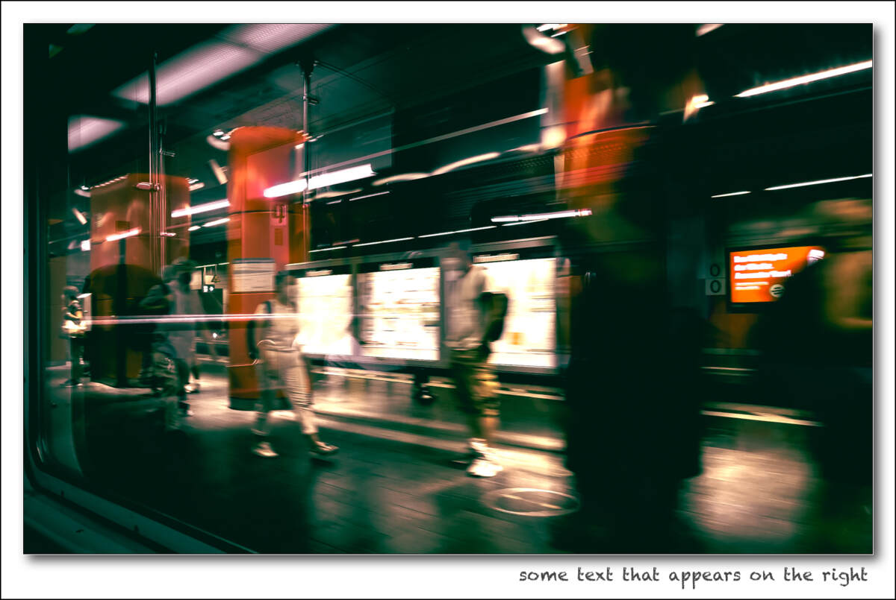
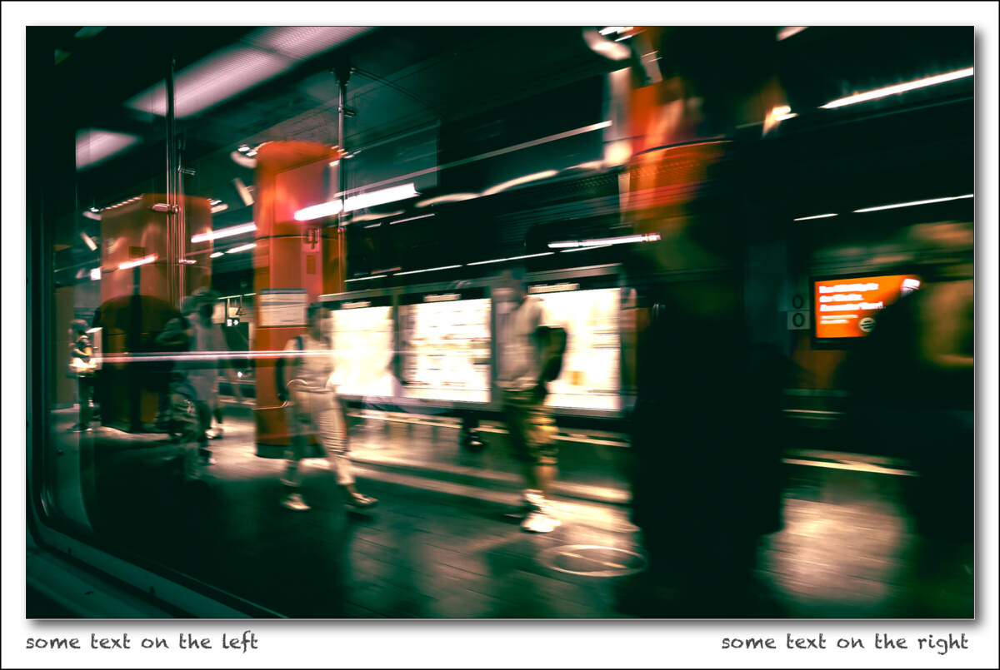

# brdr

## What it does

`brdr` adds a white border and a little drop shadow around an image. Optionally, some text can be "written" to the white border beneath the image. You can add your text to the right hand side only (e.g. copyright), or to the left (e.g. image title) and right (e.g. copyright).

As Github uses a white background for readme files, I additionally added a black frame for the sample pictures below to better show the dimensions of the added frames.

The Imagemagick command used was taken from https://drkrishi.com/creating-photo-borders-using-imagemagick/ and modified a bit.

## How to use

`brdr filename` creates

`brdr filename "some text that appears on the right"` creates

`brdr filename "some text on the left" "some text on the right"` creates

## Installation and Dependancies

You need https://imagemagick.org which is open source and free software available for - I think - all platforms.

Copy brdr to your path and enjoy.

## Configuration

There are a few configuration parameters on the top of the script. I guess they are pretty self explanatory.

## Caveat

Tested on MacOS.
